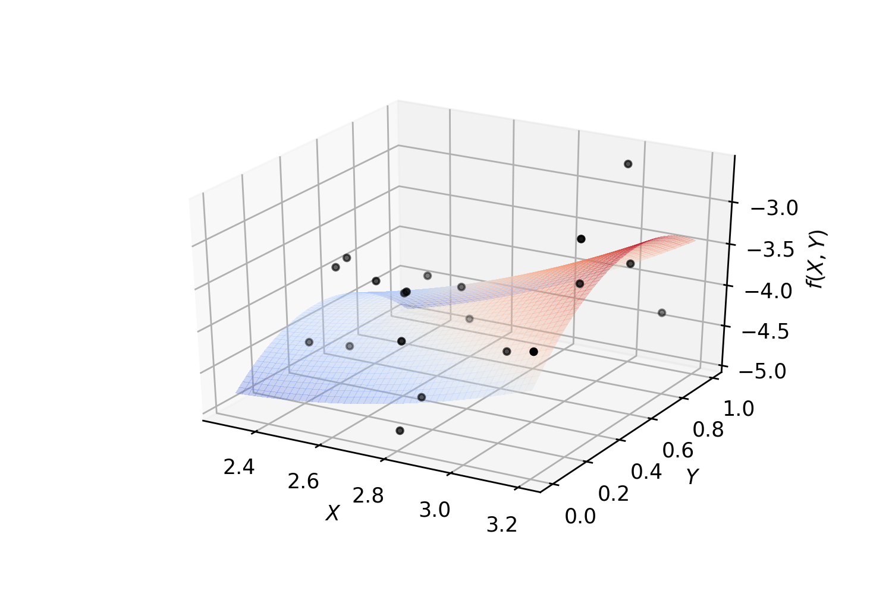

=========================
Hilbert Spaces
=========================

Orthonormal system of functions
===============================

Let `X` be a topological space and :math:`\mu` be a finite Borel measure on `X`. The bilinear function :math:`\langle\cdot,\cdot\rangle` defined
on :math:`L_2(X, \mu)` as :math:`\langle f, g\rangle = \int_X fg d\mu` is an inner product which turns :math:`L_2(X, \mu)` into a Hilbert space.

Let us denote the family of all continuous real valued functions on a non-empty compact space `X` by :math:`\textrm{C}(X)`. Suppose that among elements
of :math:`\textrm{C}(X)`, a subfamily `A` of functions are of particular interest.
Suppose that `A` is a subalgebra of :math:`\textrm{C}(X)` containing constants.
We say that an element :math:`f\in\textrm{C}(X)` can be approximated by elements of `A`, if for every :math:`\epsilon>0`, there exists
:math:`p\in A` such that :math:`|f(x)-p(x)|<\epsilon` for every :math:`x\in X`.
The following classical results guarantees when every :math:`f\in\textrm{C}(X)` can be approximated by elements of `A`.

Let :math:`(V, \langle\cdot,\cdot\rangle)` be an inner product space with :math:`\|v\|_2=\langle v,v\rangle^{\frac{1}{2}}`.
A basis :math:`\{v_{\alpha}\}_{\alpha\in I}` is called an orthonormal basis for `V` if :math:`\langle v_{\alpha},v_{\beta}\rangle=\delta_{\alpha\beta}`,
where :math:`\delta_{\alpha\beta}=1` if and only if :math:`\alpha=\beta` and is equal to `0` otherwise.
Every given set of linearly independent vectors can be turned into a set of orthonormal vectors that spans the same sub vector space
as the original. The following well-known result gives an algorithm for producing such orthonormal from a set of linearly independent vectors:

.. note::
	**Gram--Schmidt**

	Let :math:`(V,\langle\cdot,\cdot\rangle)` be an inner product space. Suppose :math:`\{v_{i}\}^{n}_{i=1}` is a set of linearly independent vectors in `V`.
	Let

	.. math::
		u_{1}:=\frac{v_{1}}{\|v_{1}\|_2}

	and (inductively) let

	.. math::
		w_{k}:=v_{k}-\sum_{i=1}^{k-1}\langle v_{k},u_{i}\rangle u_{i}\textrm{ and } u_{k}:=\frac{w_{k}}{\|w_{k}\|_2}.

	Then :math:`\{u_{i}\}_{i=1}^{n}` is an orthonormal collection, and for each `k`,

	.. math::
		span\{u_{1},u_{2},\cdots,u_{k}\}=span\{v_{1},v_{2},\cdots,v_{k}\}.

Note that in the above note, we can even assume that :math:`n=\infty`.

Let :math:`B=\{v_1, v_2, \dots\}` be an ordered basis for :math:`(V,\langle\cdot,\cdot\rangle)`. For any given vector :math:`w\in V` and any initial segment
of `B`, say :math:`B_n=\{v_1,\dots,v_n\}`, there exists a unique :math:`v\in\textrm{span}(B_n)` such that :math:`\|w-v\|_2` is the minimum:

.. note ::
	Let :math:`w\in V` and `B` a finite orthonormal set of vectors (not necessarily a basis). Then for :math:`v=\sum_{u\in B}\langle u,w\rangle u`

	.. math::
		\|w-v\|_2 = \min_{z\in\textrm{span}(B)}\|w-z\|_2.

Now, let :math:`\mu` be a finite measure on `X` and for :math:`f,g\in\textrm{C}(X)` define :math:`\langle f,g\rangle=\int_Xf g d\mu`.
This defines an inner product on the space of functions. The norm induced by the inner product is denoted by :math:`\|\cdot\|_{2}`.
It is evident that

.. math::
	\|f\|_{2}\leq\|f\|_{\infty}\mu(X),~\forall f\in\textrm{C}(X),

which implies that any good approximation in :math:`\|\cdot\|_{\infty}` gives a good :math:`\|\cdot\|_{2}`-approximation. But generally, our interest
is the other way around. Employing Gram-Schmidt procedure, we can find :math:`\|\cdot\|_{2}` within any desired accuracy, but this does not
guarantee a good :math:`\|\cdot\|_{\infty}`-approximation. The situation is favorable in finite dimensional case.
Take :math:`B=\{p_1,\dots,p_n\}\subset\textrm{C}(X)` and :math:`f\in\textrm{C}(X)`, then there exists :math:`K_f>0` such that for every
:math:`g\in\textrm{span}(B\cup\{f\})`,

.. math::
	K_f\|g\|_{\infty}\leq\|g\|_{2\leq}\|g\|_{\infty}\mu(X).

Since `X` is assumed to be compact, :math:`\textrm{C}(X)` is separable, i.e., :math:`\textrm{C}(X)` admits a countable dimensional dense subvector space
(e.g. polynomials for when `X` is a closed, bounded interval). Thus for every :math:`f\in\textrm{C}(X)` and every :math:`\epsilon>0` one can find a
big enough finite `B`, such that the above inequality holds. In other words, good enough :math:`\|\cdot\|_{2}`-approximations of `f` give good
:math:`\|\cdot\|_{\infty}`-approximations, as desired.

**Example.** Polynomial regression on 2-dimensional random data::

	from mpl_toolkits.mplot3d import Axes3D
	from matplotlib import cm
	import matplotlib.pyplot as plt
	import numpy as np
	from SKSurrogate.NpyProximation import HilbertRegressor, FunctionBasis
	def randrange(n, vmin, vmax):
		'''
		Helper function to make an array of random numbers having shape (n, )
		with each number distributed Uniform(vmin, vmax).
		'''
		return (vmax - vmin)*np.random.rand(n) + vmin

	# degree of polynomials
	deg = 2
	FB = FunctionBasis()
	B = FB.Poly(2, deg)
	# initiate regressor
	regressor = HilbertRegressor(base=B)
	# number of random points
	n = 20
	fig = plt.figure()
	ax = fig.add_subplot(111, projection='3d')
	for c, m, zlow, zhigh in [('k', 'o', -5, -2.5)]:
		xs = randrange(n, 2.3, 3.2)
		ys = randrange(n, 0, 1.0)
		zs = randrange(n, zlow, zhigh)
		ax.scatter(xs, ys, zs, c=c, s=10, marker=m)
	ax.set_xlabel('$X$')
	ax.set_ylabel('$Y$')
	ax.set_zlabel('$f(X,Y)$')
	X = np.array([np.array((xs[_], ys[_])) for _ in range(n)])
	y = np.array([np.array((zs[_],)) for _ in range(n)])
	X_ = np.arange(2.3, 3.2, 0.02)
	Y_ = np.arange(0, 1.0, 0.02)
	_X, _Y = np.meshgrid(X_, Y_)
	# fit the regressor
	regressor.fit(X, y)
	# prepare the plot
	Z = []
	for idx in range(_X.shape[0]):
		_X_ = _X[idx]
		_Y_ = _Y[idx]
		_Z_ = []
		for jdx in range(_X.shape[1]):
			t = np.array([np.array([_X_[jdx], _Y_[jdx]])])
			_Z_.append(regressor.predict(t)[0])
		Z.append(np.array(_Z_))
	Z = np.array(Z)
	surf = ax.plot_surface(_X, _Y, Z, cmap=cm.coolwarm, linewidth=0, antialiased=False, alpha=.3)

