=========================================
A machine learning progress tracker
=========================================

When exploring for reasonable methods to model a problem, usually the search quickly results in
a large number of candidates and it becomes very difficult to keep track of all models and their
performance measures. There are various existing solutions, usually forcing to follow a particular
workflow, which could be very beneficial. The present module tends to be very light, with minimal
dependency and minimal effect of the workflow.

`mltrace` loves the scikit-learn compatible models and provides many tools to work with them.
The vision and hence design of `mltrace` is based on the believe that most machine learning projects
can be turned into a study on a certain dataset. Although, as the project progresses, features may
be added to or dropped from the original data, but in most cases there is a systematic method to
derive these changes from the original source. Therefore, `mltrace` isolates a task together with
a dataset and the associated models.

Let us make up a sample classification task and trace the models via `mltrace`.

**Step 0.** Make a sample classification dataset::

    # import requires libraries
    import numpy as np
    import pandas as pd
    from sklearn.datasets import make_classification
    from SKSurrogate import *
    # make up a classification dataset
    X, y = make_classification(n_samples=1000, n_features=10, n_informative=6, n_redundant=2)
    Xy = np.hstack((X, np.reshape(y, (-1, 1))))
    # make up some names for columns of the data
    cols = ['cl%d'%(_+1) for _ in range(10)] + ['target']
    # turn it into a pandas DataFrame
    df = np2df(Xy, cols)()

**Step 1.** Initiate the tracker and register the data::

    # initialize the tracker with a task called 'sample'
    MLTr = mltrack('sample', db_name="sample.db")
    # register the data
    MLTr.RegisterData(df, 'target')
    # modify the description of the task
    MLTr.UpdateTask({'description': "This is a sample task to demonstrate\\
            capabilities of the mltrace."})

**Step 2.** Get to know the data by visualizing correlations and sensitivities::

    from sklearn.gaussian_process.kernels import Matern, Sum, ExpSineSquared
    from sklearn.kernel_ridge import KernelRidge
    from sklearn.model_selection import RandomizedSearchCV
    # use a regressor to approximate the data
    param_grid_kr = {"alpha": np.logspace(-4, 1, 20),
                  "kernel": [Sum(Matern(), ExpSineSquared(l, p))
                             for l in np.logspace(-2, 2, 10)
                             for p in np.logspace(0, 2, 10)]}
    rgs = RandomizedSearchCV(KernelRidge(),
            param_distributions=param_grid_kr, n_iter=10, cv=2)
    # ask for specific weights to be calculated and recorded
    MLTr.FeatureWeights(regressor=rgs,
            weights=('pearson', 'sobol', 'morris', 'delta-mmnt'))
    # visualise
    plt1 = MLTr.heatmap(sort_by='pearson')
    plt1.show()
    cor = df.corr()
    plt2 = p = MLTr.heatmap(cor, idx_col=None, cmap='rainbow')
    plt2.show()

|sens| |corr|

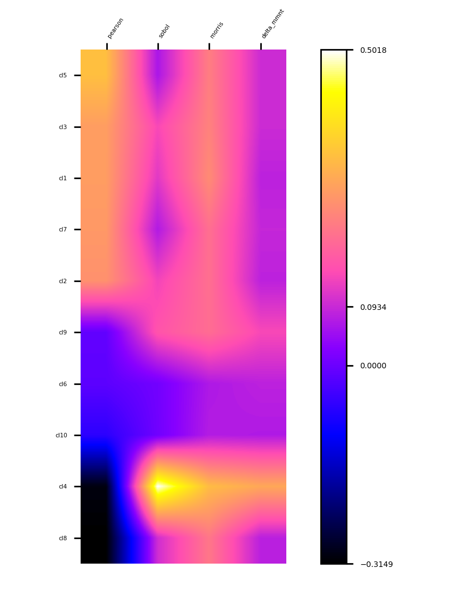
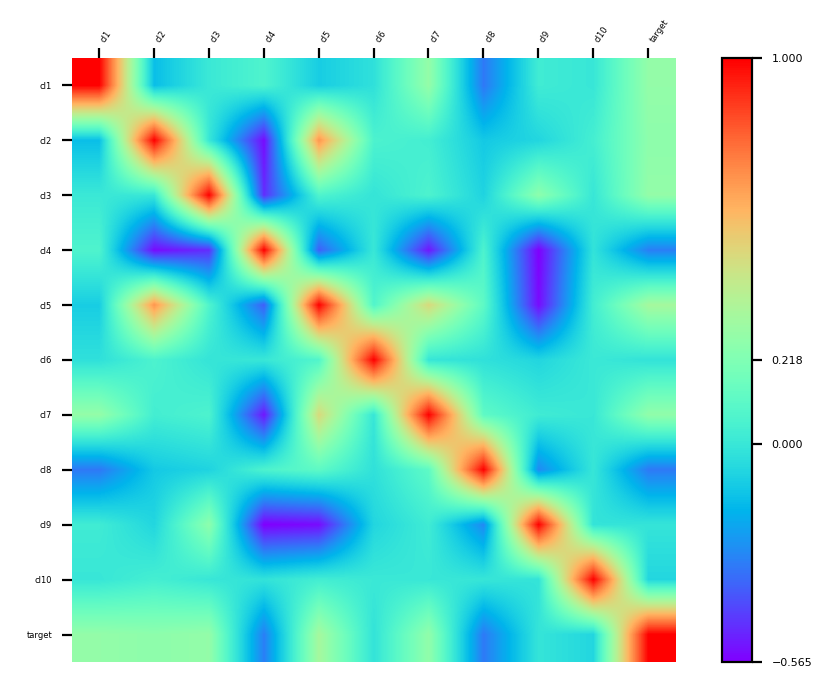

**Step 3.** Examine and log a random forest model and its metrics::

    from sklearn.ensemble import RandomForestClassifier
    from sklearn.model_selection import cross_val_score, ShuffleSplit
    # retrieve data
    X, y = MLTr.get_data()
    # init classifier
    clf = RandomForestClassifier(n_estimators=50)
    # log the classifier
    clf = MLTr.LogModel(clf, "RandomForestClassifier(50)")
    # find the average metrics
    print(MLTr.LogMetrics(clf, cv=ShuffleSplit(5, .25)))
    # {'accuracy': 0.8816, 'auc': 0.9504791437613562, 'precision': 0.9029848807772192,
    # 'f1': 0.8782525829634803, 'recall': 0.8554950898148654, 'mcc': 0.7640884799286114,
    # 'logloss': 4.089427586800243, 'variance': None, 'max_error': None, 'mse': None,
    # 'mae': None, 'r2': None}

**Step 4.** Search for best (in terms of accuracy) classifier as a combination of
``naive_bayes.GaussianNB``, ``linear_model.LogisticRegression``, ``lightgbm.LGBMClassifier``,
``preprocessing.StandardScaler``, and ``preprocessing.Normalizer``::

    from SKSurrogate import *
    # set up the confic dictionary
    config = {
        # estimators
        'sklearn.naive_bayes.GaussianNB': {
            'var_smoothing': Real(1.e-9, 2.e-1)
        },
        'sklearn.linear_model.LogisticRegression': {
            'penalty': Categorical(["l1", "l2"]),
            'C': Real(1.e-6, 10.),
            "class_weight": HDReal((1.e-5, 1.e-5), (20., 20.))
        },
        "lightgbm.LGBMClassifier": {
            "boosting_type": Categorical(['gbdt', 'dart', 'goss', 'rf']),
            "num_leaves": Integer(2, 100),
            "learning_rate": Real(1.e-7, 1. - 1.e-6),  # prior='uniform'),
            "n_estimators": Integer(5, 250),
            "min_split_gain": Real(0., 1.),  # prior='uniform'),
            "subsample": Real(1.e-6, 1.),  # prior='uniform'),
            "importance_type": Categorical(['split', 'gain'])
        },
        # preprocessing
        'sklearn.preprocessing.StandardScaler': {
            'with_mean': Categorical([True, False]),
            'with_std': Categorical([True, False]),
        },
        'sklearn.preprocessing.Normalizer': {
            'norm': Categorical(['l1', 'l2', 'max'])
        },
    }
    # initiate and perform the search
    A = AML(config=config, length=3, check_point='./sample/', verbose=1)
    A.eoa_fit(X, y, max_generation=15, num_parents=20)
    # retrieve and log the best
    eoa_clf = A.best_estimator_
    eoa_clf = MLTr.LogModel(eoa_clf, "Best of EOA Surrogate Search")
    print(MLTr.LogMetrics(eoa_clf, cv=ShuffleSplit(5, .25)))
    MLTr.PreserveModel(eoa_clf)
    # {'accuracy': 0.8824, 'auc': 0.9207884992789751, 'precision': 0.8930688738450767,
    # 'f1': 0.8789651291713657, 'recall': 0.8664344690110679, 'mcc': 0.7657250436230718,
    # 'logloss': 4.061801043429923, 'variance': None, 'max_error': None, 'mse': None,
    # 'mae': None, 'r2': None}

**Step 5.** Plot learning curves for accuracy, :math:`F_1`, area under ROC, calibration lift and
 cumulative curves for the two models::

    # the best of EOA Surrogate Search
    MLTr.plot_learning_curve(eoa_clf, "Best of Surrogate Search", cv=ShuffleSplit(5, .25), measure='accuracy')
    MLTr.plot_learning_curve(eoa_clf, "Best of Surrogate Search", cv=ShuffleSplit(5, .25), measure='f1')
    MLTr.plot_learning_curve(eoa_clf, "Best of Surrogate Search", cv=ShuffleSplit(5, .25), measure='roc_auc')
    MLTr.plot_calibration_curve(eoa_clf, "Best of Surrogate Search")
    MLTr.plot_cumulative_gain(eoa_clf, title="Best: Cumulative Gains Curve")
    MLTr.plot_lift_curve(eoa_clf, title="Best: Lift Curve")
    # Random Forest
    MLTr.plot_learning_curve(clf, "Random Forest", cv=ShuffleSplit(5, .25), measure='accuracy')
    MLTr.plot_learning_curve(clf, "Random Forest", cv=ShuffleSplit(5, .25), measure='f1')
    MLTr.plot_learning_curve(clf, "Random Forest", cv=ShuffleSplit(5, .25), measure='roc_auc')
    MLTr.plot_calibration_curve(clf, "Random Forest")
    MLTr.plot_cumulative_gain(clf, title="Random Forest: Cumulative Gains Curve")
    MLTr.plot_lift_curve(clf, title="Random Forest: Lift Curve")

*The Best of EOA*

|plt1| |plt2|
|plt3| |plt4|
|plt5| |plt6|

*Random Forest*

|plt7| |plt8|
|plt9| |plt10|
|plt11| |plt12|

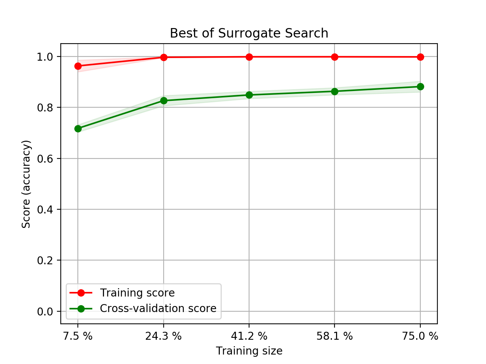
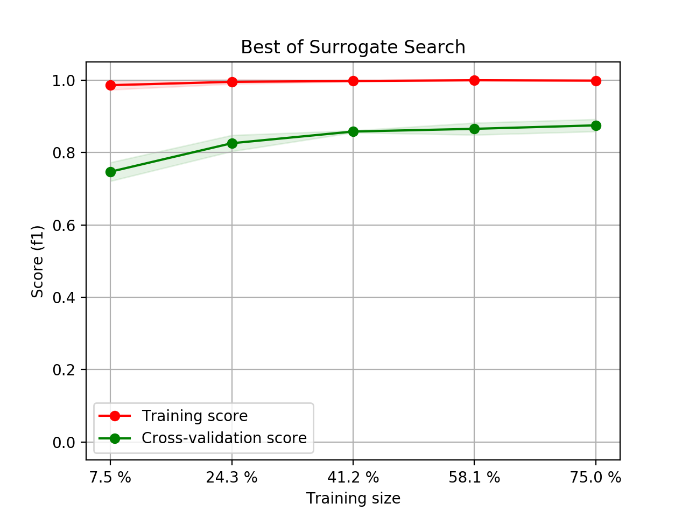
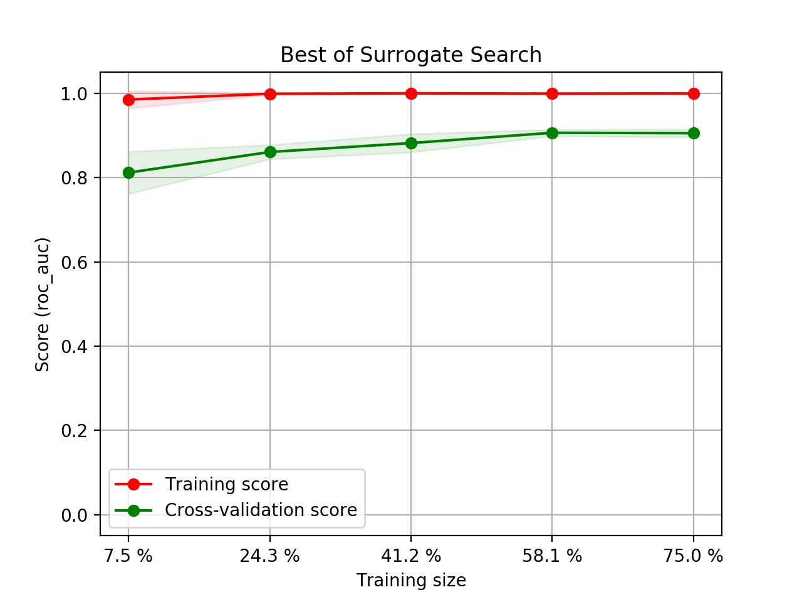
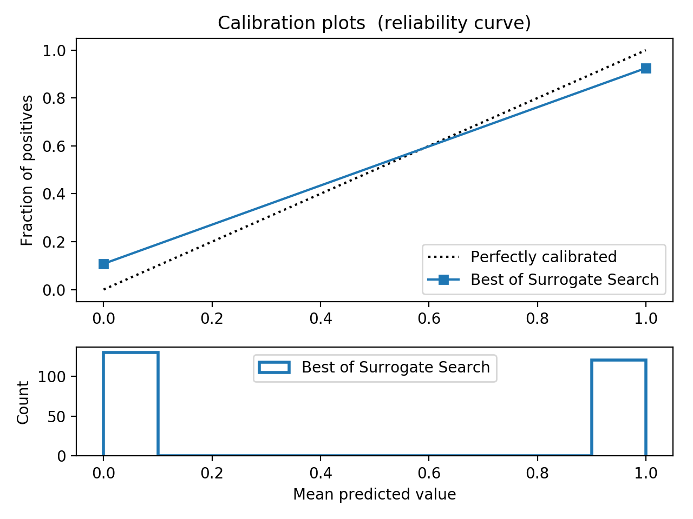
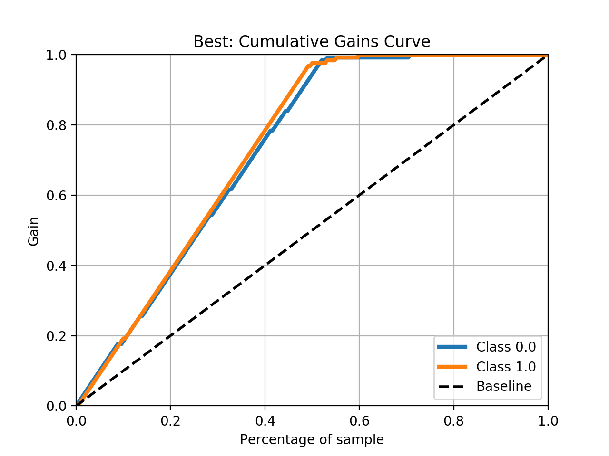
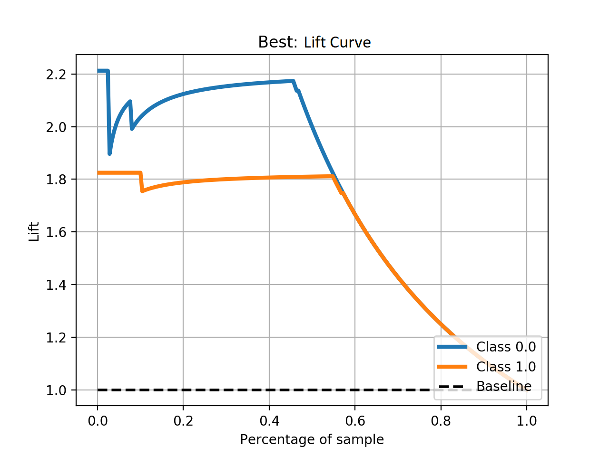
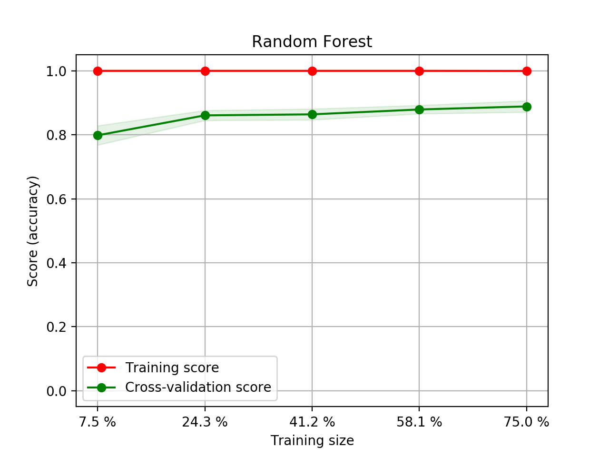
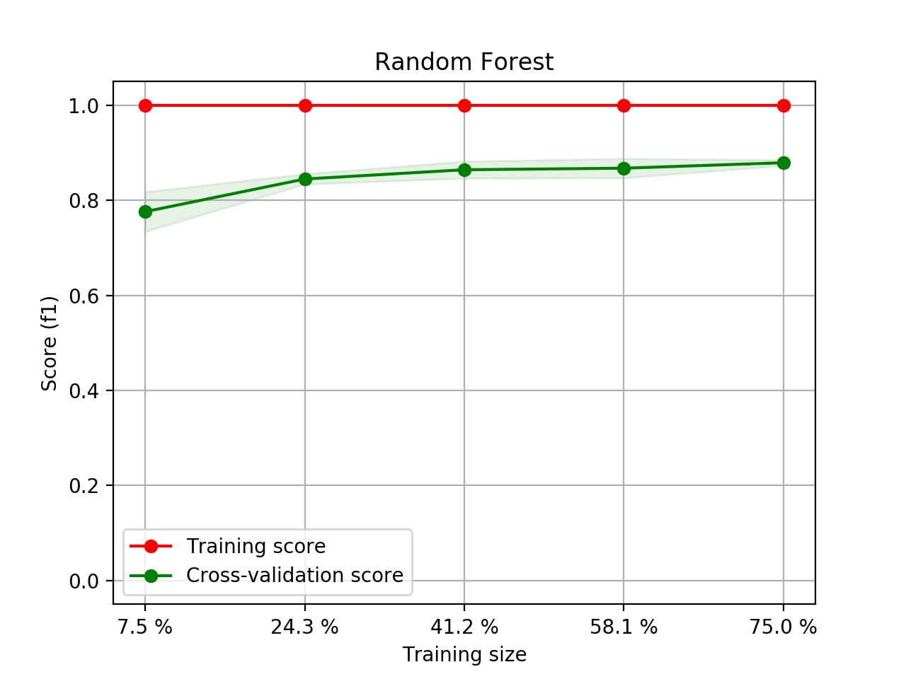
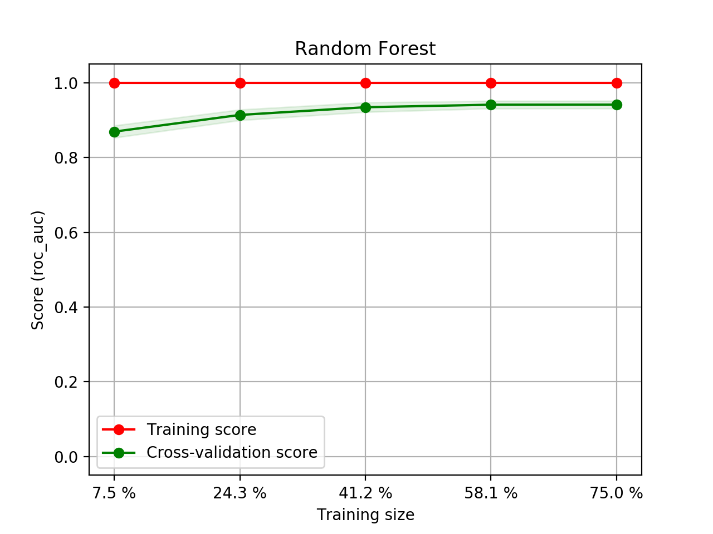
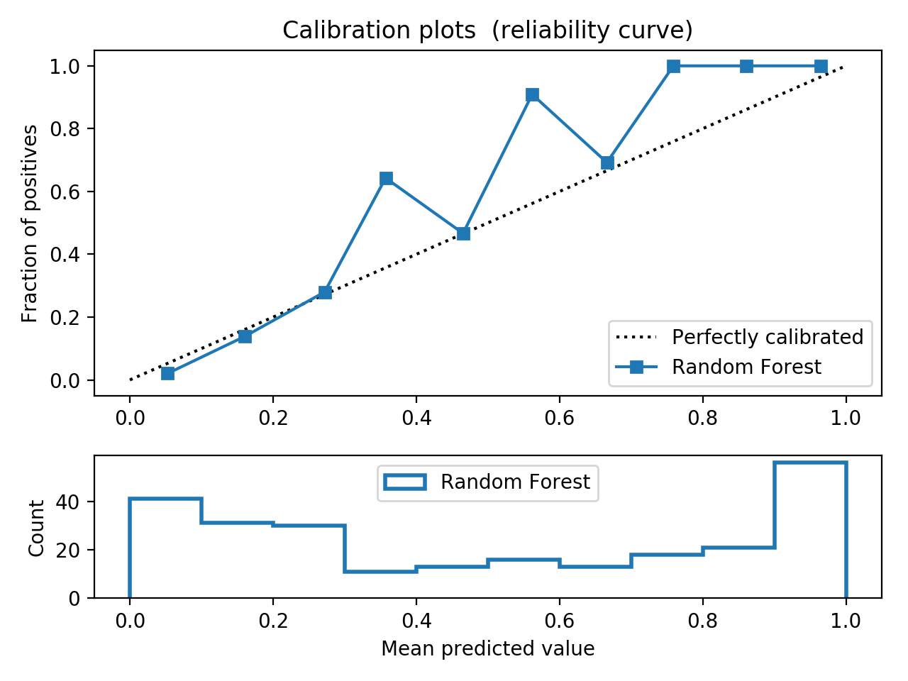
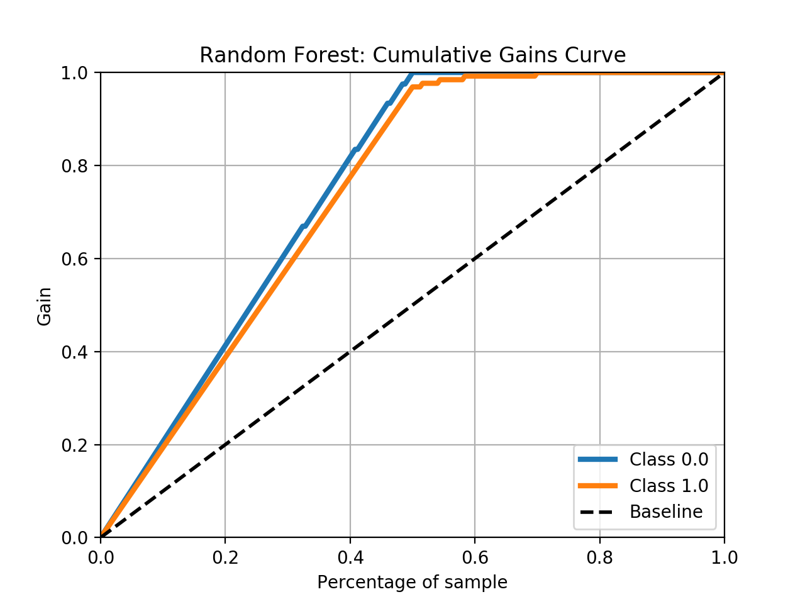
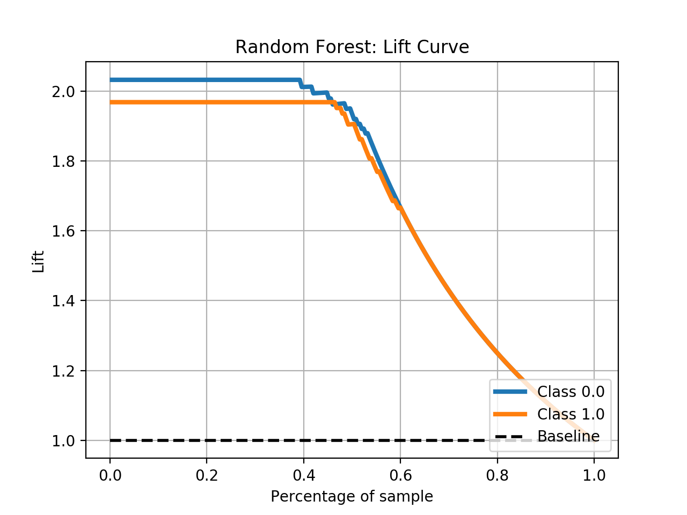

SVM Classifier with RBF v.s. SGDClassifier with Kernels
==========================================================
We try to see whether SVM classifiers with RBF kernel and SGDClassifres with kernel can compare.
We set up a quick ``SKSurrogate`` search with ``SVC`` and `NuSVC` as classifiers and another
quick ``SKSurrogate`` search over ``SGDClassifier``, ``Nystroem`` and ``RBFSampler`` kernels::

    import numpy as np
    from SKSurrogate import *
    import warnings
    warnings.filterwarnings("ignore", category=Warning)

    from sklearn.model_selection import RandomizedSearchCV
    from sklearn.kernel_ridge import KernelRidge
    from sklearn.gaussian_process.kernels import Matern, Sum, ExpSineSquared
    param_grid_krr = {"alpha": np.logspace(-4, 0, 5),
                      "kernel": [Sum(Matern(), ExpSineSquared(l, p))
                                 for l in np.logspace(-2, 2, 10)
                                 for p in np.logspace(0, 2, 10)]}
    regressor = RandomizedSearchCV(KernelRidge(), param_distributions=param_grid_krr, n_iter=7, cv=2)

    config = {
        # estimators
        'sklearn.svm.SVC': {
            "C": Real(1e-6, 20.),
            "gamma": Real(1e-6, 10.),
            "tol": Real(1e-6, 10.),
            "class_weight": HDReal((1.e-5, 1.e-5), (20., 20.))
        },
        'sklearn.svm.NuSVC': {
            'nu': Real(1.e-5, 1.),
            "gamma": Real(1e-6, 10.),
            "tol": Real(1e-6, 10.),
            "class_weight": HDReal((1.e-5, 1.e-5), (20., 20.))
        },
        # preprocessing
        'sklearn.preprocessing.StandardScaler': {
            'with_mean': Categorical([True, False]),
            'with_std': Categorical([True, False]),
        },
        'sklearn.feature_selection.VarianceThreshold': {
            'threshold': Real(0., .3)
        },
        'sklearn.preprocessing.Normalizer': {
            'norm': Categorical(['l1', 'l2', 'max'])
        },
    }

    MLTr = mltrack('sample', db_name="sample.db")
    X, y = MLTr.get_data()

    A_svm = AML(config=config, length=3, check_point='./svm/', verbose=1)
    A_svm.eoa_fit(X, y, max_generation=10, num_parents=10)
    print(A_svm.get_top(4))

Which results in::

    OrderedDict([(('sklearn.feature_selection.VarianceThreshold',
               'sklearn.preprocessing.Normalizer',
               'sklearn.svm.SVC'),
              (Pipeline(memory=None,
                    steps=[('stp_0', VarianceThreshold(threshold=0.20066923736000097)), ('stp_1', Normalizer(copy=True, norm='l2')), ('stp_2', SVC(C=15.110221076172207, cache_size=200,
                 class_weight={0.0: 13.581338880577112, 1.0: 3.1546898782179706},
                 coef0=0.0, decision_function_shape='ovr', degree=3, gamma=10.0,
                 kernel='rbf', max_iter=-1, probability=False, random_state=None,
                 shrinking=True, tol=1e-06, verbose=False))]),
               -0.9253333333333333)),
             (('sklearn.preprocessing.StandardScaler',
               'sklearn.preprocessing.Normalizer',
               'sklearn.svm.SVC'),
              (Pipeline(memory=None,
                    steps=[('stp_0', StandardScaler(copy=True, with_mean=True, with_std=False)), ('stp_1', Normalizer(copy=True, norm='l1')), ('stp_2', SVC(C=14.396152757785778, cache_size=200,
                 class_weight={0.0: 11.644799650485178, 1.0: 14.834346896165036},
                 coef0=0.0, decision_function_shape='ovr', degree=3,
                 gamma=1.387860853481898, kernel='rbf', max_iter=-1, probability=False,
                 random_state=None, shrinking=True, tol=1.3386685658572253, verbose=False))]),
               -0.9253333333333333)),
             (('sklearn.svm.NuSVC',
               'sklearn.preprocessing.Normalizer',
               'sklearn.svm.SVC'),
              (Pipeline(memory=None,
                    steps=[('stp_0', StackingEstimator(decision=True,
                        estimator=NuSVC(cache_size=200,
                  class_weight={0.0: 16.514247793012903, 1.0: 19.743755570932407},
                  coef0=0.0, decision_function_shape='ovr', degree=3,
                  gamma=2.879810799993445, kernel='rbf', max_iter=-1,
                  nu=5.366323874825201e-05, pr...robability=False,
                 random_state=None, shrinking=True, tol=0.0002612195258127529,
                 verbose=False))]), -0.9226666666666666)),
             (('sklearn.feature_selection.VarianceThreshold',
               'sklearn.preprocessing.Normalizer',
               'sklearn.svm.NuSVC'),
              (Pipeline(memory=None,
                    steps=[('stp_0', VarianceThreshold(threshold=0.10372588511430014)), ('stp_1', Normalizer(copy=True, norm='l2')), ('stp_2', NuSVC(cache_size=200,
                  class_weight={0.0: 4.756565216129669, 1.0: 14.36176825433476},
                  coef0=0.0, decision_function_shape='ovr', degree=3,
                  gamma=5.437271690133034, kernel='rbf', max_iter=-1,
                  nu=0.6557563687772239, probability=False, random_state=None,
                  shrinking=True, tol=2.1918030657741365, verbose=False))]),
               -0.9186666666666666)))])

And for ``SGDClassifier``::

    import numpy as np
    from SKSurrogate import *
    import warnings
    warnings.filterwarnings("ignore", category=Warning)

    from sklearn.model_selection import RandomizedSearchCV
    from sklearn.kernel_ridge import KernelRidge
    from sklearn.gaussian_process.kernels import Matern, Sum, ExpSineSquared
    param_grid_krr = {"alpha": np.logspace(-4, 0, 5),
                      "kernel": [Sum(Matern(), ExpSineSquared(l, p))
                                 for l in np.logspace(-2, 2, 10)
                                 for p in np.logspace(0, 2, 10)]}
    regressor = RandomizedSearchCV(KernelRidge(), param_distributions=param_grid_krr, n_iter=7, cv=2)

    config = {
        # estimators
        'sklearn.linear_model.SGDClassifier': {
            'loss': Categorical(['hinge', 'log', 'modified_huber', 'squared_hinge', 'perceptron']),
            'penalty': Categorical(['none', 'l2', 'l1', 'elasticnet']),
            'alpha': Real(1.e-5, .9999),
            'l1_ratio': Real(0., 1.),
            'tol': Real(1.e-5, 1.),
            'class_weight': HDReal((1.e-5, 1.e-5), (20., 20.))
        },
        # preprocessing
        'sklearn.preprocessing.StandardScaler': {
            'with_mean': Categorical([True, False]),
            'with_std': Categorical([True, False]),
        },
        'sklearn.feature_selection.VarianceThreshold': {
            'threshold': Real(0., .3)
        },
        'sklearn.preprocessing.Normalizer': {
            'norm': Categorical(['l1', 'l2', 'max'])
        },
        # Transformers
        'sklearn.kernel_approximation.Nystroem': {
            'kernel': Categorical(['rbf', 'poly', 'sigmoid']),
            'gamma': Real(1.e-6, 10.),
            'n_components': Integer(10, 120)
        },
        'sklearn.kernel_approximation.RBFSampler': {
            'gamma': Real(1.e-6, 10.),
            'n_components': Integer(10, 120)
        },
    }

    MLTr = mltrack('sample', db_name="sample.db")
    X, y = MLTr.get_data()

    A_sgd = AML(config=config, length=3, check_point='./svm/', verbose=2)#, cat_cols=[5])
    A_sgd.fit(X, y)
    print(A_sgd.get_top(4))

Which results in::

    OrderedDict([(('sklearn.linear_model.SGDClassifier',
                   'sklearn.kernel_approximation.Nystroem',
                   'sklearn.linear_model.SGDClassifier'),
                  (Pipeline(memory=None,
                        steps=[('stp_0', StackingEstimator(decision=True,
                            estimator=SGDClassifier(alpha=1.0186882143892309e-05, average=False,
                          class_weight={0.0: 1e-05, 1.0: 1e-05}, early_stopping=False,
                          epsilon=0.1, eta0=0.0, fit_intercept=True,
                          l1_ratio=0.16668760571866542, learning_rate='op...om_state=None, shuffle=True,
                          tol=1.0, validation_fraction=0.1, verbose=0, warm_start=False))]),
                   -0.8946666666666667)),
                 (('sklearn.preprocessing.Normalizer',
                   'sklearn.kernel_approximation.RBFSampler',
                   'sklearn.linear_model.SGDClassifier'),
                  (Pipeline(memory=None,
                        steps=[('stp_0', Normalizer(copy=True, norm='l1')), ('stp_1', RBFSampler(gamma=5.09346829872262, n_components=120, random_state=None)), ('stp_2', SGDClassifier(alpha=1e-05, average=False,
                          class_weight={0.0: 6.299501235657723, 1.0: 14.399482243823948},
                          early_stopping=False, epsilon=0.1,..._state=None, shuffle=True,
                          tol=1e-05, validation_fraction=0.1, verbose=0, warm_start=False))]),
                   -0.8946666666666667)),
                 (('sklearn.kernel_approximation.Nystroem',
                   'sklearn.preprocessing.Normalizer',
                   'sklearn.linear_model.SGDClassifier'),
                  (Pipeline(memory=None,
                        steps=[('stp_0', Nystroem(coef0=None, degree=None, gamma=7.102137254366565, kernel='poly',
                        kernel_params=None, n_components=51, random_state=None)), ('stp_1', Normalizer(copy=True, norm='l2')), ('stp_2', SGDClassifier(alpha=0.4030001737762923, average=False,
                          class_weight={0.0: 16.5900487...shuffle=True, tol=0.6700383879862661,
                          validation_fraction=0.1, verbose=0, warm_start=False))]),
                   -0.8906666666666667)),
                 (('sklearn.preprocessing.Normalizer',
                   'sklearn.kernel_approximation.Nystroem',
                   'sklearn.linear_model.SGDClassifier'),
                  (Pipeline(memory=None,
                        steps=[('stp_0', Normalizer(copy=True, norm='l2')), ('stp_1', Nystroem(coef0=None, degree=None, gamma=5.928661960771689, kernel='poly',
                        kernel_params=None, n_components=117, random_state=None)), ('stp_2', SGDClassifier(alpha=0.5112964074641659, average=False,
                          class_weight={0.0: 3.2816638...shuffle=True, tol=0.7276228102426916,
                          validation_fraction=0.1, verbose=0, warm_start=False))]),
                   -0.884))])

This shows a :math:`3.06\%` loss in accuracy