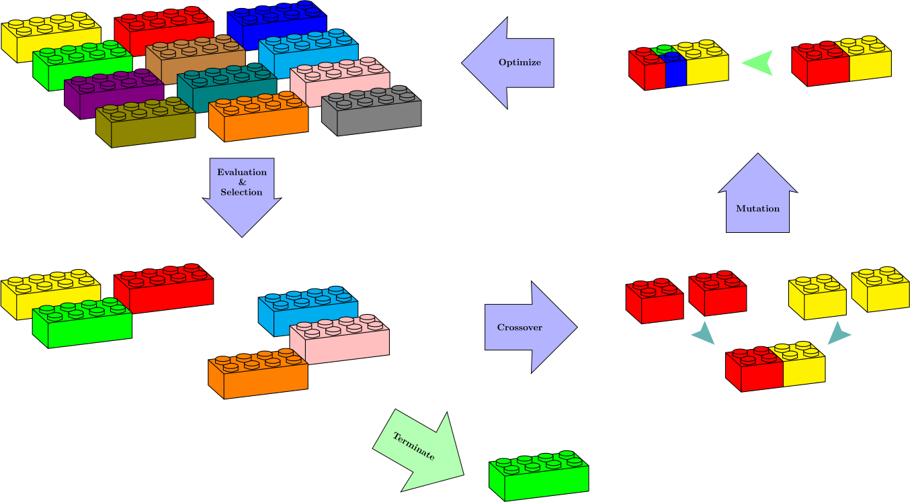

=====================================
Optimized Pipeline Detector
=====================================

In this part, we speculate about possibility of searching for optimized pipelines that
perform some preprocessing, sensitivity analysis, and composing estimators to achieve an
optimum performance measure, based on a pre-determined set of operators and estimators,
all inherited from scikit-learn's base classes.

Suppose that we have some data transformers :math:`\mathbb{T}=\{T_1,\dots, T_k\}` and some estimators
:math:`\mathbb{E}=\{E_1,\dots, E_m\}` and willing to find a composition
:math:`P=F_1\circ F_2\circ\dots\circ F_n` where :math:`F_1\in\mathbb{E}` and :math:`F_i\in\mathbb{T}\cup\mathbb{E}`
for :math:`i=2,\dots,n` and the composition is optimal with respect to a given performance measure.
Each estimator/transformer may accept a number of parameters, discrete or continuous. Note that there
are :math:`m\times(m+k)^{n-1}` different combinations based on :math:`\mathbb{T}` and :math:`\mathbb{E}`.
So, the number of possible pipelines grows exponentially as the number of building blocks increase.
Now, if we want to examine all possible combinations of at most :math:`N` estimator/transformer, the
domain would be of the form

.. math::
    \mathbb{U} = \bigcup_{n=1}^N \mathbb{E}\times(\mathbb{E}\cup\mathbb{T})^{n-1}.

each element of :math:`\mathbb{U}` corresponds to infinitely many functions as the set of acceptable
hyperparameters for each one is potentially infinite. Suppose that :math:`P\in\mathbb{U}` and
:math:`\tilde{x}` is the set of its parameters. We use surrogate optimization to find

.. math::
    \tilde{x}_P=\textrm{argmax}_{\tilde{x}}\mu(P(\tilde{x})(X)),

(or :math:`\textrm{argmax}` depending on the task) where :math:`X` is the test set, :math:`\mu` is the performance and
deal with the elements of

.. math::
    \tilde{\mathbb{U}}=\{P(\tilde{x}_P) : P\in\mathbb{U}\},

that are already optimized with respect to their hyperparameters. This reduces the optimized
pipeline detection to searching :math:`\tilde{\mathbb{U}}` to find an optimum pipeline. This is
still a very heavy task to accomplish given the number of elements in :math:`\mathbb{U}` and the
computational intensity of a surrogate optimization. Fortunately, the format of the elements of
:math:`\mathbb{U}` is very much suggestive and demands for a genetic algorithm to reach an optima.

The `AML` class accepts a set of estimators and transformers, dictionaries of their parameters that
can be changed, and searches the space of possible pipelines either exhaustively or according to an
evolutionary set up to find an optimum pipeline.

**Example 1:** The following is a classification based on
`sk-rebate <https://github.com/EpistasisLab/scikit-rebate/tree/master/data>`_ data::

    # Find an optimum classification pipeline

    import pandas as pd
    import numpy as np
    from sklearn.model_selection import RandomizedSearchCV
    from sklearn.kernel_ridge import KernelRidge
    from sklearn.gaussian_process.kernels import Matern, Sum, ExpSineSquared
    from SKSurrogate import *

    param_grid_krr = {
        "alpha": np.logspace(-4, 0, 5),
        "kernel": [
            Sum(Matern(), ExpSineSquared(l, p))
            for l in np.logspace(-2, 2, 10)
            for p in np.logspace(0, 2, 10)
        ],
    }
    regressor = RandomizedSearchCV(
        KernelRidge(), param_distributions=param_grid_krr, n_iter=5, cv=2
    )

    config = {
        # Classifiers
        "sklearn.naive_bayes.GaussianNB": {"var_smoothing": Real(1.0e-9, 2.0e-1)},
        "sklearn.linear_model.LogisticRegression": {
            "penalty": Categorical(["l1", "l2"]),
            "C": Real(1.0e-6, 10.0),
            "class_weight": HDReal((1.0e-5, 1.0e-5), (20.0, 20.0))
            # 'dual': Categorical([True, False])
        },
        "sklearn.svm.SVC": {
            "C": Real(1e-6, 20.0),
            "gamma": Real(1e-6, 10.0),
            "tol": Real(1e-6, 10.0),
            "class_weight": HDReal((1.0e-5, 1.0e-5), (20.0, 20.0)),
        },
        "lightgbm.LGBMClassifier": {
            "boosting_type": Categorical(["gbdt", "dart", "goss", "rf"]),
            "num_leaves": Integer(2, 100),
            "learning_rate": Real(1.0e-7, 1.0 - 1.0e-6),  # prior='uniform'),
            "n_estimators": Integer(5, 250),
            "min_split_gain": Real(0.0, 1.0),  # prior='uniform'),
            "subsample": Real(1.0e-6, 1.0),  # prior='uniform'),
            "importance_type": Categorical(["split", "gain"]),
        },
        # Preprocesssors
        "sklearn.preprocessing.StandardScaler": {
            "with_mean": Categorical([True, False]),
            "with_std": Categorical([True, False]),
        },
        "skrebate.ReliefF": {
            "n_features_to_select": Integer(2, 10),
            "n_neighbors": Integer(2, 10),
        },
        # Sensitivity Analysis
        "SKSurrogate.sensapprx.SensAprx": {
            "n_features_to_select": Integer(2, 20),
            "method": Categorical(["sobol", "morris", "delta-mmnt"]),
            "regressor": Categorical([None, regressor]),
        },
    }
    import warnings

    warnings.filterwarnings("ignore", category=Warning)

    genetic_data = pd.read_csv(
        "https://github.com/EpistasisLab/scikit-rebate/raw/master/data/"
        "GAMETES_Epistasis_2-Way_20atts_0.4H_EDM-1_1.tsv.gz",
        sep="\t",
        compression="gzip",
    )
    X, y = genetic_data.drop("class", axis=1).values, genetic_data["class"].values

    A = AML(config=config, length=3, check_point="./", verbose=2)
    A.eoa_fit(X, y, max_generation=10, num_parents=10)
    print(A.get_top(5))

In order to perform an exhaustive search on all possible pipelines just replace the last line
with the following::

    A.fit(X, y)

We can retrieve the top `n` models via ``A.get_top(n)``.

**Example 2:** The following is a regression based on
`Airfoil Self-Noise Data Set <https://archive.ics.uci.edu/ml/datasets/Airfoil+Self-Noise>`_ data::

    # Find an optimum regression pipeline

    import pandas as pd
    import numpy as np
    from sklearn.model_selection import RandomizedSearchCV
    from sklearn.kernel_ridge import KernelRidge
    from sklearn.gaussian_process.kernels import Matern, Sum, ExpSineSquared
    from SKSurrogate import *

    config = {
        # Regressors
        "sklearn.linear_model.LinearRegression": {"normalize": Categorical([True, False])},
        "sklearn.kernel_ridge.KernelRidge": {
            "alpha": Real(1.0e-4, 10.0),
            "kernel": Categorical(
                [
                    Sum(Matern(), ExpSineSquared(l, p))
                    for l in np.logspace(-2, 2, 10)
                    for p in np.logspace(0, 2, 10)
                ]
            ),
        },
        # Preprocesssors
        "sklearn.preprocessing.StandardScaler": {
            "with_mean": Categorical([True, False]),
            "with_std": Categorical([True, False]),
        },
        "sklearn.preprocessing.Normalizer": {"norm": Categorical(["l1", "l2", "max"])},
        # Feature Selectors
        "sklearn.feature_selection.VarianceThreshold": {"threshold": Real(0.0, 0.3)},
    }
    import warnings

    warnings.filterwarnings("ignore", category=Warning)

    df = pd.read_csv(
        "https://archive.ics.uci.edu/ml/machine-learning-databases/00291/airfoil_self_noise.dat",
        sep="\t",
        names=["Frequency", "Angle", "length", "velocity", "thickness", "level"],
    )
    X = df.drop("level", axis=1).values
    y = df["level"].values

    A = AML(
        config=config,
        length=3,
        check_point="./",
        verbose=2,
        scoring="neg_mean_squared_error",
    )
    A.eoa_fit(X, y, max_generation=12, num_parents=12)
    print(A.get_top(5))

Some Technical Notes
============================
It should be evident from the example that the `config` dictionary's keys could point to any module
that is available from the working folder. The only constraint is that the classes being used must
inherit from ``sklearn.base.BaseEstimator``, ``RegressorMixin``, ``ClassifierMixin``,
``TransformerMixin`` or ``imblearn.base.SamplerMixin``, ``BaseSampler``.

The last estimator will always be selected from either ``RegressorMixin`` or ``ClassifierMixin``.
The case of ``imblearn.base.SamplerMixin``, ``BaseSampler`` can only occur at the beginning of the
pipeline. The rest could be ``RegressorMixin``, ``ClassifierMixin`` or ``TransformerMixin``.

Stacking
--------------------------
If a non ``TransformerMixin`` occurs in the middle, then by ``StackingEstimator`` it will transform
the data to append columns based on the outcome of ``RegressorMixin`` or ``ClassifierMixin``.

Permutation Importance
--------------------------
If ``sklearn.pipeline.FeatureUnion`` is included within the config dictionary, in the scope of a
pipeline two scenarios are plausible:

    + **`FeatureUnion` is followed by a series of transformations:** in this case `FeatureUnion`
        does exactly what is expected, i.e., gathers all the feature outputs of transformers;
    + **`FeatureUnion` is followed by a mixture of transformations and estimators:** then
        `SKSurrogate` uses ``eli5.sklearn.PermutationImportance`` to weight the features based on
        the estimators and ``AML``'s scoring and then selects top features via
        ``sklearn.feature_selection.SelectFromModel``.

Not all transformers select a subset of of features (e.g., `Normalizer` or `StandardScaler`). If
`FeatureUnion` is followed by such transformers, it does not have any effect on the outcome of the
transformer. If the transformer selects a subset of features (`VarianceThreshold`, `skrebate.ReliefF`)
then `FeatureUnion` collects the outcomes and returns the union. This is also true for
`PermutationImportance`. The `FeatureUnion` affects the following transformers and estimators until
it reaches the last step or a transformer which is not a feature selector. Subclasses of
``sklearn.feature_selection.base.SelectorMixin`` are considered as feature selectors. Also, the
following transformers are considered as feature selectors:

    - `FactorAnalysis`
    - `FastICA`
    - `IncrementalPCA`
    - `KernelPCA`
    - `LatentDirichletAllocation`
    - `MiniBatchDictionaryLearning`
    - `MiniBatchSparsePCA`
    - `NMF`
    - `PCA`
    - `SparsePCA`
    - `TruncatedSVD`
    - `VarianceThreshold`
    - `LocallyLinearEmbedding`
    - `Isomap`
    - `MDS`
    - `SpectralEmbedding`
    - `TSNE`
    - `sksurrogate.SensAprx`
    - `skrebate.ReliefF`
    - `skrebate.SURF`
    - `skrebate.SURFstar`
    - `skrebate.MultiSURF`
    - `skrebate.MultiSURFstar`
    - `skrebate.TuRF`

imblearn pipelines
--------------------------
If an ``imblearn`` sampler is included in the `config` dictionary, then
``imblearn.pipeline.Pipeline`` will be used instead of ``sklearn.pipeline.Pipeline`` which enables
the Pipeline to use `imblearn <https://imbalanced-learn.readthedocs.io/en/stable/index.html>`_
samples too.

Categorical Variables
--------------------------
In case there are fields in the data that need to be treated as categorical, one could provide a
list of indices through `cat_cols`. Then, the data will be transformed via
``category_encoders.one_hot.OneHotEncoder`` before being passed to the pipelines.