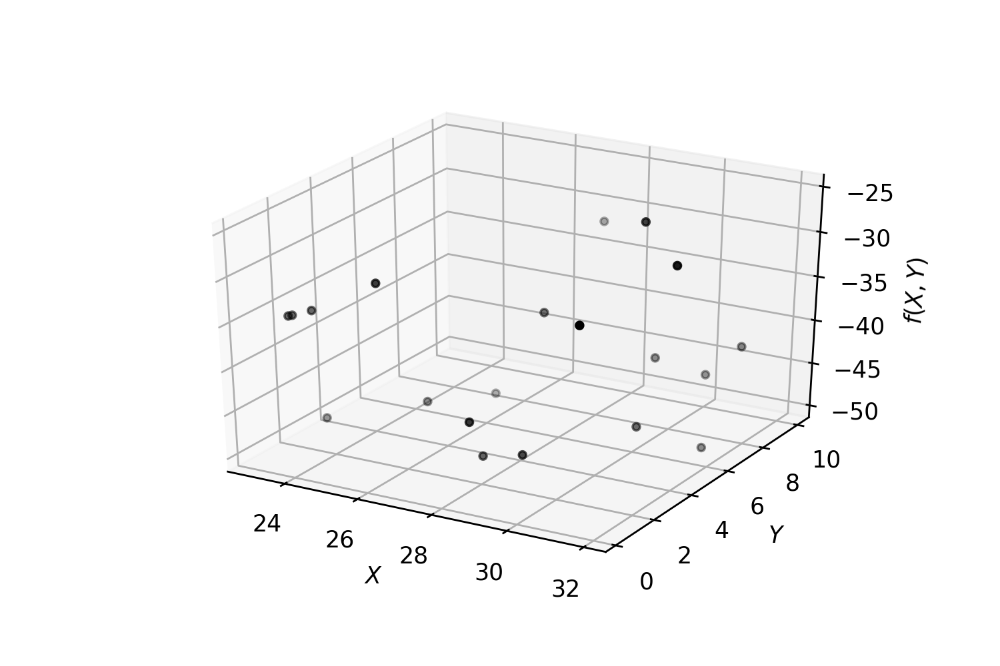
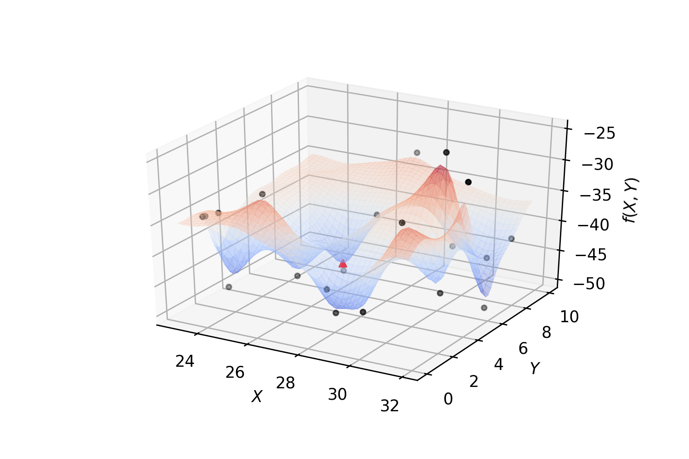

===================================
Surrogate-Based Optimization
===================================
Surrogate-based optimization represents a class of optimization methodologies that make
use of surrogate modeling techniques to quickly find the local or global optima.
It provides us a novel optimization framework in which the conventional optimization algorithms,
e.g. gradient-based or evolutionary algorithms are used for sub-optimization.

For optimization problems, surrogate models can be regarded as approximation models for
the cost function and state function, which are built from sampled data obtained by
randomly probing the design space. Once the surrogate models are built, an optimization
algorithm can be used to search the new candidate, based on the surrogate models,
that is most likely to be the optimum. Since the prediction with a surrogate model is
generally much more efficient than that with a numerical analysis code, the
computational cost associated with the search based on the surrogate models is
generally negligible. Surrogate modeling is referred to as a technique that makes use
of the sampled data to build surrogate models, which are sufficient to predict the output
of an expensive function at untried points in the feasibility space. Thus, how to choose
sample points, how to build surrogate models, and how to evaluate the accuracy of surrogate
models are key issues for surrogate optimization.

Fit a regressor and find a (local) minimum:

The following algorithm summarizes implemented Surrogate-Based Optimization for an
expensive function :math:`f` that can only be evaluated `MaxIter` times with a minimum
`MinEvals` random evaluations.

.. note::
    set :math:`E=\emptyset`, :math:`NumIter=0`

    while :math:`NumIter<MaxIter` do

        sample a random point :math:`x_0` from feasible space

        if :math:`\#(E) < MinEvals` then
            update :math:`E=E\cup\{(x_0, f(x_0))\}`

        else
            find a surrogate :math:`\hat{f}` that fits the points in :math:`E`

            find the minimum :math:`x_*` of :math:`\hat{f}` using :math:`x_0` as the initial point (if required)

            evaluate :math:`f` at :math:`x_*` and update :math:`E=E\cup\{(x_*, f(x_*))\}`

        update :math:`NumIter = NumIter+1`

    return the pair :math:`(x, y)\in E` with lowest found value for :math:`y` as the approximation for the minimum of :math:`f`

Clearly, there are various methods to accomplish some of the steps in the above algorithm like
how to sample a new point :math:`x_0`, how to find the surrogate :math:`\hat{f}`, how to minimize
and how to decide when we wish to use the surrogate.

Sampling
===================================
Three different sampling methods have been implemented and the `SurrogateSearch` class accepts
user defined sampling classes that have a certain signature.

CompactSample
---------------------------
This class samples a random point from the feasibility set.

BoxSample
---------------------------
This class samples a random point from a cube centered around a given point (usually
the last point :math:`f` was evaluated on) with a given length. It makes sure that the sample
belongs to the feasibility set.

The length of the edges of the cube can be provided by setting `init_radius` (default: 2.)

A contraction ratio can be provided by setting `contraction` (should be bigger than 0 and
less than 1) to shrink the volume of the cube to assure fast convergence to a (local) optima
(default value: 0.9).

SphereSample
---------------------------
This class samples a random point from a sphere centered around a given point (usually
the last point :math:`f` was evaluated on) with a given radius. It makes sure that the sample
belongs to the feasibility set.

The radius of the sphere can be provided by setting `init_radius` (default: 2.)

A contraction ratio can be provided by setting `contraction` (should be bigger than 0 and
less than 1) to shrink the radius of the sphere to assure fast convergence to a (local) optima
(default value: 0.9).

.. note::
    The sampling method can be passed to an instance of `SurrogateSearch` via `sampling` parameter.
    Along with `sampling` class, `radius`, `contraction`, `ineq`, and `bounds` may be provided to
    be used by the sampling class. `ineq` is a list of callables which represent the constraints.
    `bounds` is a list of tuples of real numbers representing the bounds on each variable.

.. tip::
    A user-defined sampling class should follow the following  structure::

        class UserSample(object):
            def __init__(self, **kwargs):
                pass

            def check_constraints(self, point):
                """
                Checks constraints on the sample if provided;
                `point` is the candidate to be checked;
                should return a `boolean` True or False for if all constraints hold or not.
                """
                pass

            def sample(self, centre, cntrctn=1.):
                """
                Samples a point out of an sphere centered at `centre`;

                `centre` is a `numpy.array` the center of the sphere;
                `cntrctn` is a  `float` customized contraction factor
                returns a `numpy.array` the new sample
                """
                pass

Surrogate models
===================================
By default, `SurrogateSearch` uses a polynomial surface of degree 3 to approximate :math:`f`
based on existing data and will be updated on each iteration where a new piece of information a
bout :math:`f` is found. Typically, any regressor inherited from `RegressorMixin` that implements
a `fit` and a `predict` method can be used.

Optimizer
===================================
A `scipy` optimizer can be used to find a minimum of the surrogate at each iteration.
Note that if `ineqs` is not `None`, then most of scipy optimizers can not be used.
The optimizers that work well with constraints include 'SLSQP' and 'COBYLA'.

An alternative for the scipy optimizer is 'Optimithon'.

===================================
Hyperparameter Optimization
===================================
Hyperparameter Optimization in machine learning with respect to a given performance measure
(e.g., accuracy, f1, auc, ...) usually is a computationally expensive task which fits within
the scope of surrogate optimization technique. In fact this is the main reason that the project
exists. Therefore, there is a special class designed for hyperparameter optimization of machine
learning methods that follow the schema of the very popular machine learning library `scikit-learn`.
The class `structsearch.SurrogateRandomCV` is a substitute for scikit-learn's `GridSearchCV` or
`RandomizedSearchCV`. An isntance of `SurrogateRandomCV` takes an estimator like `GridSearchCV` and
`RandomizedSearchCV` and a `params` parameter, like `param_grid` or `param_distributions`,
which determines (ranges of) the values each argument of the estimator can take over.
The difference is that not only it accepts discrete list of values for each parameter, it also
accepts ranges of integers and real numbers too. The `params` is a dictionary whose keys are
the estimator's arguments and their values are objects of the followin types:

    + `Real(a, b)`: an interval of real numbers between :math:`a` and :math:`b`;
    + `Integer(a, b)`: an interval of integer numbers between :math:`a` and :math:`b`;
    + `Categorical(list)`: a list consists of discrete values;
    + `HDReal(a, b)`: An `n` dimensional box of real numbers corresponding to the classification groups (e.g. `class_weight`). `a` is the tuple of lower bounds and `b` is the tuple of upper bounds.

**Example** The following code searches for the best values for a `SVC`::

    from sklearn.svm import SVC
    from SKSurrogate import *
    clf = SVC()
    params = {'C': Real(1.e-5, 10),
              'kernel': Categorical(['poly', 'rbf']),
              'degree': Integer(1, 4),
              'gamma': Real(1.e-5, 10),
              'class_weight': HDReal((1.e-3, 1.e-3), (10., 10.))}
    srch = SurrogateRandomCV(clf, params)
    srch.fit(X, y)
    print(srch.best_estimator_)

.. note::
    It is worth mentioning that using a Gaussian Process Regression as the regressor simulates
    a particular variation of the optimization method known as Bayesian Optimization method.

    Bayesian Optimization is the method employed by the popular package
    `skopt <https://scikit-optimize.github.io/>`_. The ui implemented for ``SurrogateRandomCV``
    is very much similar to the one of ``skopt.BayesSearchCV``, so one could use the same code
    for both given that the imports are carefully done.

.. tip::
    The class ``SurrogateRandomCV`` works with intervals to handel the hyperparameters and
    the current sampling classes do not impose extra constraints on ``SurrogateSearch`` other
    than ranges for parameters, alternative `scipy.minimize` solvers can be used as well, such
    as `L-BFGS-B`, `TNC`, `SLSQP`.