=====================================
Step-by-Step Web UI User Manual
=====================================

This manual walks through a typical SKSurrogate workflow in the web UI:
register data, inspect features, search and evaluate models, package and
approve a model, run inference, and monitor its behavior. Each screen is tied
to the corresponding SKSurrogate library feature so you can move between the
UI and Python/API workflows.

The screenshots use a disposable ``manual-demo`` task and the sample CSV files
linked below. They illustrate the interface; your task names, model versions,
metrics, and available actions will differ.

.. contents:: In this manual
   :local:
   :depth: 2

Before you start
================

The control-plane API and web UI are optional applications run from a source
checkout. They are separate from using ``SKSurrogate`` as a Python library.
Follow :doc:`controlplane` for dependency installation, service startup, API
keys, CORS, and storage configuration. In brief:

1. From the repository root, install the API dependencies and start the API:

   .. code-block:: console

      python -m pip install -r requirements.txt
      uvicorn api.main:app --reload --host 127.0.0.1 --port 8013

2. In another terminal, start the web UI:

   .. code-block:: console

      cd webui
      npm ci
      npm run dev

3. Open the local URL printed by Vite. The UI's development server proxies
   ``/api`` requests and job WebSockets to port ``8013`` by default.

For a local walkthrough, download the
:download:`training CSV <ui-manual-example.csv>` and the separate
:download:`validation CSV <ui-manual-validation.csv>`. They are small,
synthetic examples for interface practice, not meaningful model benchmarks.

.. warning::

   The API is open when ``SKSURROGATE_API_KEY`` is unset. Do not expose a
   keyless service to an untrusted network. If you enable a key, enter it on
   **Settings / Audit**. The UI stores the API base URL and key in this
   browser's local storage; use a trusted browser profile.

The workflow at a glance
========================

The UI is organized around a task, which groups data, runs, bundles, registry
history, inference records, and monitoring. The usual flow is:

``Task → Datasets → Feature Analysis → Experiments → Evaluation → Model Bundles
→ Quality Gates → Registry & Deployment → Inference → Monitoring → Retraining``

You can also train a baseline directly under **Model Bundles**, skip optional
feature analysis, or use the API and Python package independently of the UI.
Long-running sensitivity, experiment, nested-CV, and retraining operations
appear in **Jobs**.

1. Open the Dashboard and select a task
---------------------------------------

The **Dashboard** summarizes API health, background jobs, monitoring alerts,
and links to the main pipeline stages. Use the **Task** picker in the top bar
to select an existing task or choose **+ Add new task…** and enter a short,
stable name such as ``customer-churn``. The new name is held in the browser
until you create task data or run a task operation.

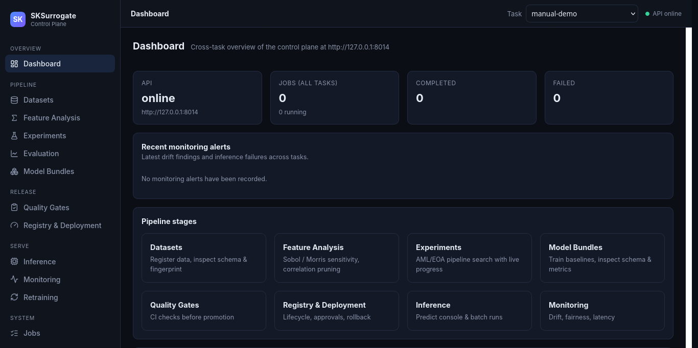

   Dashboard overview. The task picker is shared across task-specific pages.

The task name is the common identifier used by ``mltrack``, model bundles,
registry aliases, and monitoring records. Choose the right task before
uploading data or launching work; use a different task when the data or model
lifecycle should be kept separate.

2. Register and validate datasets
---------------------------------

Open **Datasets**. For each CSV partition:

1. Set **Partition** to ``train``, ``validation``, or ``test`` (or another
   descriptive partition name).
2. Drop the CSV into the upload area or click it to browse.
3. Click **Inspect CSV**. This previews the row count, columns, inferred data
   types, possible target columns, and a name-based scan for PII-like or
   sensitive column names. Inspection does not commit the file.
4. Choose the **Target column**. Review the detected type of every column and
   change any incorrect type before committing. If appropriate, enable
   **Binarize / ordinal-encode target labels** to encode target categories.
5. Click **Commit dataset**. The API registers the partition and schema,
   calculates a dataset fingerprint, and stores the CSV under the task.

Use the same target and compatible feature columns across partitions. For the
tutorial, register the training file as ``train`` and the second file as
``validation``. In a real workflow, keep validation data separate from
training data; do not use a copy of the training rows as a holdout.

If the task already has a registered schema, **Validate upload** checks a new
CSV against it before you commit. The Python tracking layer is
``SKSurrogate.mltrace.mltrack``: ``RegisterData`` records dataset metadata,
``validate_data`` checks training data, and ``validate_prediction_data``
checks inference inputs. The checks catch column, order, dtype, and category
differences; use the explicit compatibility options in the Python API only
when a relaxed contract is intended.

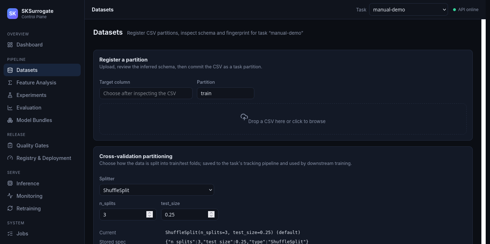

   Dataset registration and the task-level cross-validation settings.

After registration, review **Registered metadata** for the target, feature
count, fingerprint, and partitions. Use **Target statistics** to inspect the
target distribution. The optional **Synthetic data** card can generate a
downloadable sample from a registered partition; choose the row count, source
partition, marginal or joint distribution, and a generation type for each
column. Synthetic output is a generated file, not a replacement for the
registered source dataset.

Choose **Cross-validation partitioning** deliberately. The selected splitter
and its parameters are stored for the task and reused by downstream
cross-validation. For classification, use a stratified splitter when class
balance matters; for grouped or time-ordered observations, select a splitter
that preserves that structure rather than randomly mixing related or future
observations across folds.

3. Inspect and reduce features (optional)
-----------------------------------------

Open **Feature Analysis** after registering a training partition.

* **Sensitivity analysis** ranks feature importance with Sobol, Morris, or
  delta-moment methods. Choose the method, number of top features, and training
  partition, then click **Run sensitivity analysis**. This runs as a background
  job. Inspect its ranking and heatmap when complete.
* **Correlation pruning** applies a threshold to the absolute pairwise
  correlation between features. It reports which features would be kept or
  dropped; it does not silently rewrite the registered CSV.
* **Heatmaps** show sensitivity ranking, Pearson correlation, or feature
  weights. Weight values can come from stored ``mltrack.FeatureWeights`` data
  or be computed from target correlation and feature variance when appropriate.
* **Consensus top features** summarizes how often each feature appears in the
  top-ranked sets stored for the task.

These correspond to ``SKSurrogate.sensapprx.SensAprx``,
``CorrelationThreshold``, and the feature-analysis methods on
``SKSurrogate.mltrace.mltrack`` (including ``heatmap`` and ``TopFeatures``).
Use the analysis to guide a smaller experiment search space or a domain review;
do not treat an importance ranking as proof of causality.

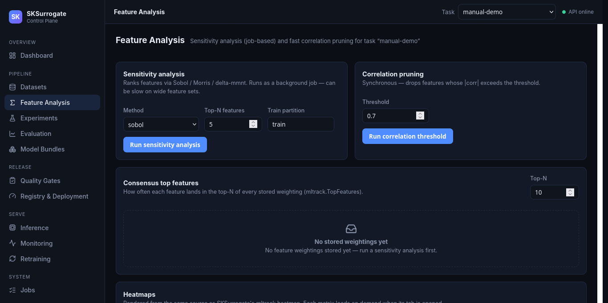

   Feature ranking and correlation tools for the selected task.

4. Search model pipelines
-------------------------

Open **Experiments**. The page starts with a JSON search-space example. Each
top-level key identifies a fully-qualified scikit-learn estimator class;
parameter definitions specify real, integer, or categorical ranges. Validate
the JSON and search-space definitions before starting. The **Add stacking
component** and **Add forbidden rule** buttons help construct supported
directives without hand-writing them.

Then configure the run:

1. Set the trial length, maximum generation, number of parents, and training
   partition. Keep an experiment small for an initial smoke test.
2. Choose a scoring metric that matches the task and the business objective.
   The selected scorer is the objective the search optimizes.
3. Choose **Evolutionary (EOA)** or **Surrogate-assisted** search. The latter
   adds surrogate iterations and may take longer per generation.
4. Keep the **Local** execution backend unless a Dask-enabled API environment
   is available.
5. Click **Start experiment**, then follow progress on the page or in **Jobs**.

The API builds an ``SKSurrogate.aml.AML`` search and uses
``SKSurrogate.eoa.EOA`` for evolutionary optimization; the surrogate path can
also use ``SurrogateRandomCV``. The optional ``stacking`` directive configures
``StackingEstimator`` wrappers that generate out-of-fold intermediate
features. Conditional parameters and forbidden combinations constrain
incompatible choices.

When the job completes, inspect the score history, top pipelines, and
score-versus-duration Pareto frontier. Use **Optimize this structure** to tune
one of the returned component sequences. A completed search creates a bundle
that appears in **Model Bundles**. Use **Jobs** to inspect job status and
details; failed experiment jobs may offer a resume action when a checkpoint
allows it.

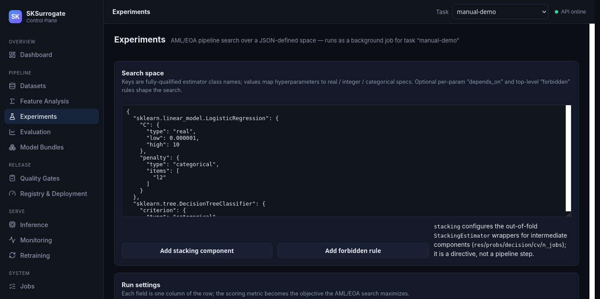

   Search-space editor and experiment settings. The run controls continue
   below the visible portion of the screen.

5. Evaluate candidate models
----------------------------

Open **Evaluation** to compare the metrics recorded on each bundle. The
overview compares the bundles side by side; metric tabs compute learning
curves across training sizes using the task's saved splitter. Classification
bundles also provide ROC, calibration, cumulative-gain, and lift diagnostics.

For a more rigorous estimate, choose a bundle in **Nested CV**, set inner and
outer fold counts and repeats, and click **Run nested CV**. The inner loop
selects/tunes the estimator; the outer loop estimates generalization. This is
a background job and can be expensive. Keep an untouched validation or test
partition for a final check after tuning.

Evaluation uses scikit-learn scorers and cross-validation through the
control-plane evaluation routes and the tracking/evaluation helpers. Learning
curves and diagnostic curves are distinct from nested CV: inspect the
displayed partition, splitter, and curve description before comparing results.
If a metric is unavailable for a bundle, the page reports the per-bundle
failure rather than treating it as a score.

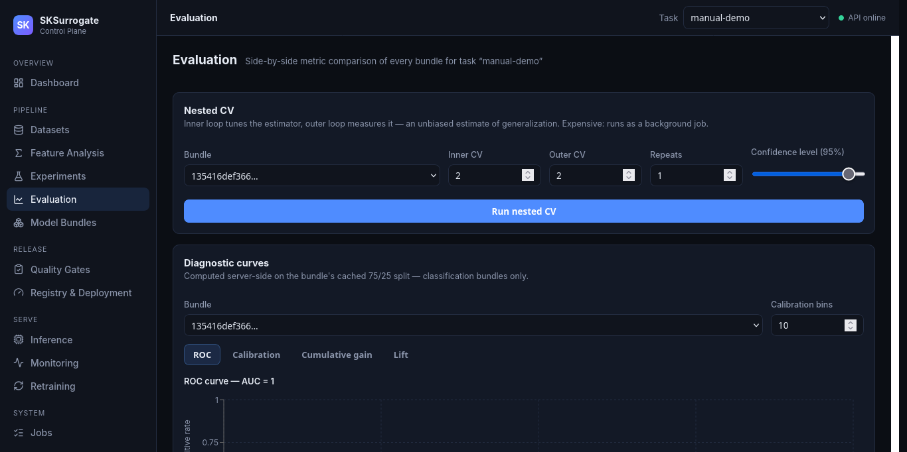

   Evaluation controls and metric comparison. Charts appear after at least one
   bundle has been created.

6. Create and inspect model bundles
------------------------------------

You can create a bundle either by completing an experiment or by fitting one
baseline in **Model Bundles**. For a baseline, select an estimator, training
partition, and optional validation partition, then click **Train baseline**.
Available baselines include linear/logistic regression and random-forest
regressors/classifiers. A validation partition adds a ``score`` metric; leave
it empty only when you intentionally do not have a holdout.

Select a model version and click **Inspect** to review its metrics, feature
schema, dataset fingerprint, dependencies, audit events, and lineage. A
``ModelBundle`` packages the fitted estimator and its metadata; the bundle is
saved as a versioned ``.bundle`` file. You can also:

* click **Jump to best** to select the bundle with the best rankable metric;
* use **Preserve snapshot** for a legacy tracking snapshot, or recover an
  existing snapshot into a new bundle version;
* download the bundle or export it to an MLflow-compatible model directory.

Bundle persistence and loading correspond to ``ModelBundle``, ``save_bundle``,
``load_bundle``, and ``export_mlflow`` in ``SKSurrogate.modelbundle``.
Serialized models should only be loaded from trusted sources.

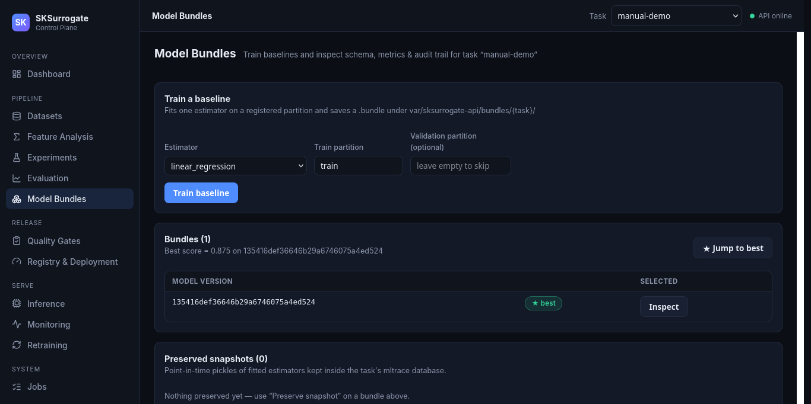

   A bundle's generated model version and validation score.

7. Run quality gates before release
------------------------------------

In **Quality Gates**, select the bundle version. Optionally set a maximum
bundle file size and define numeric metric minimums as a JSON object, for
example:

.. code-block:: json

   {"score": 0.75}

Click **Run quality gate** and review each check and any failures. The
underlying ``SKSurrogate.ci.check_bundle_quality`` helper checks that the
bundle can be loaded and evaluates the configured metric thresholds and
optional file-size limit. For an application-specific schema contract, also
validate the relevant dataset or inference input; a metric threshold alone
does not establish that a model is suitable for deployment.

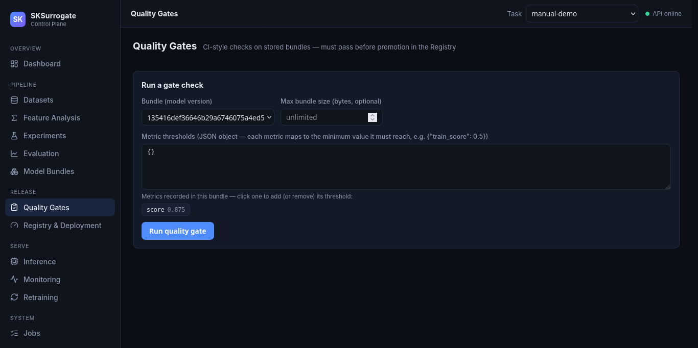

   Select the metrics recorded in a bundle to add a minimum threshold.

.. important::

   Treat a passing gate as a release prerequisite, but note that the current
   UI's **Promote** form does not automatically attach or enforce the gate
   report. It is a separate step. Enforce the policy in your release process
   or call the API with the passing ``quality_report`` when promotion must be
   programmatically blocked on a failed check.

8. Register, approve, and promote a model
-----------------------------------------

Open **Registry & Deployment**:

1. In **Register a bundle**, select the version from Model Bundles and click
   **Register**. The registry records it as a ``candidate`` and makes it
   available through the ``latest`` alias.
2. In **Promote**, select that version, choose a lifecycle state such as
   ``validated`` or ``production``, enter approver names, and set the number
   of required unique names.
3. Promote through your organization's review stages. The page displays the
   aliases, lifecycle history, approval events, audit log, and lineage.
4. If a production alias needs to point to another version, use **Rollback**
   to select the target model version and lifecycle alias.
5. Use **Use in Inference** to open the selected registry alias in the
   Inference page.

This workflow uses ``ModelRegistry`` and ``DeploymentApprovalGate`` from
``SKSurrogate.modelbundle`` and ``SKSurrogate.deployment``. Lifecycle states
include candidate, validated, staging, production, and archived.

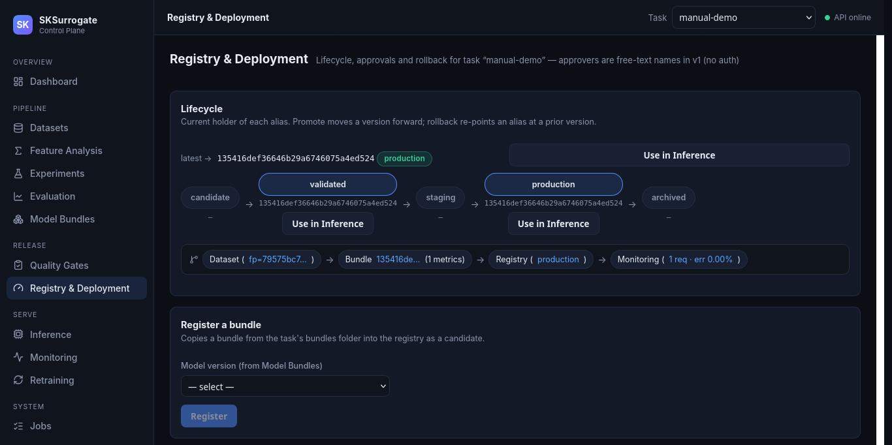

   Model version lifecycle, current aliases, lineage, and registry actions.

.. warning::

   Approver names in this UI are free-text entries, not verified user
   identities. The current v1 control plane does not provide user accounts or
   role-based authorization. Enabling the optional shared API key protects
   access to the API but does not turn those names into authenticated
   approvals.

9. Run online or batch inference
--------------------------------

On **Inference**, explicitly resolve a model by version or registry alias.
For a quick request, choose a stored partition or enter JSON rows and click
**Run prediction**. Turn on **Validate before run** to check the input
against the task's registered data schema before prediction. Review the
returned predictions, model version, request ID, latency, row count, ignored
columns, and lineage.

For stored partitions, the API projects the data onto the bundle's feature
schema, which removes the target label and normalizes feature order. Inline
rows are treated as the serving payload and must match the bundle schema.
Schema failures are shown as errors rather than silently coercing unknown
features.

Use **Batch run** to score the selected input in bulk. The output is saved as
a CSV artifact under the task's predictions directory and can be linked to
monitoring and registry lineage. These actions wrap
``SKSurrogate.inference.predict_batch`` and its schema validation.

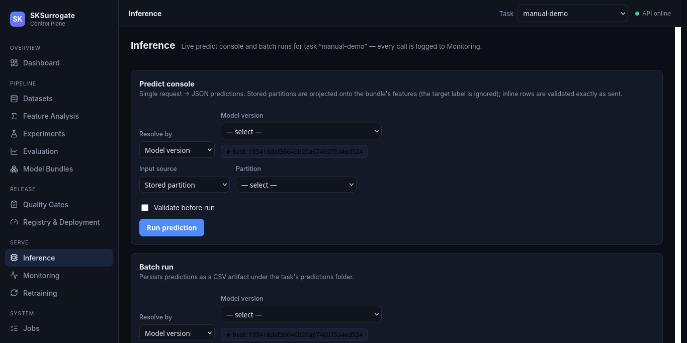

   Choose an exact model version or registry alias before scoring.

10. Monitor serving quality and data drift
------------------------------------------

Open **Monitoring** after scoring data:

* **Serving summary** reports request count, rows, mean latency, throughput,
  and error rate for the selected model version.
* **Drift check** compares a reference partition with a current partition.
  Review schema changes, missingness, numeric population stability index
  (PSI), categorical distribution distance, range drift, and threshold
  alerts.
* **Prediction distribution drift** compares two prediction series from
  partitions, persisted batch artifacts, or inline values.
* **Subgroup performance** compares a selected metric across groups.
* **PII & sensitive columns** scans column names for PII-like and explicitly
  sensitive names. This check does not read cell values.
* **Fairness** compares group-level selection rates and true-positive rates.
  Supply correctly aligned ``y_true``, ``y_pred``, and group arrays.
* **Delayed-label performance** compares saved predictions with labels that
  arrive later; choose the task type and model version.

Inference requests are logged automatically. The reports correspond to
``drift_report``, ``prediction_distribution_report``,
``subgroup_performance_report``, ``sensitive_feature_report``,
``fairness_report``, ``delayed_label_performance``, and ``InferenceMonitor``
in ``SKSurrogate.monitoring``. These are decision-support signals: review
alerts and subgroup definitions in context rather than treating thresholds
as universal fairness or drift guarantees.

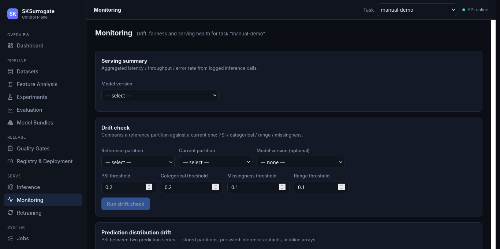

   Monitoring offers separate views for serving health, feature drift,
   prediction drift, fairness, and delayed outcomes.

11. Configure a retraining run
------------------------------

Open **Retraining** when you need a new model version:

1. Choose **Baseline** for one estimator or **Experiment (AML)** to search a
   JSON-defined parameter space.
2. Select the training partition, scorer when searching, and an available
   execution backend.
3. Set a trigger: ``always`` runs now; ``scheduled`` and ``on_data`` evaluate
   the corresponding **due** or **has new data** boolean.
4. Optionally choose a registry promotion state. The completed retraining job
   creates a new model version and can register it in that state.
5. Click **Start retraining** and follow the job in the page or in **Jobs**.

The Python workflow maps to ``SKSurrogate.retraining.RetrainingJob`` and the
execution backends. The trigger choices are evaluated by a submitted run;
they do not install a recurring scheduler or continuously watch for new data.
Review the resulting bundle and quality gates before using a new production
version.

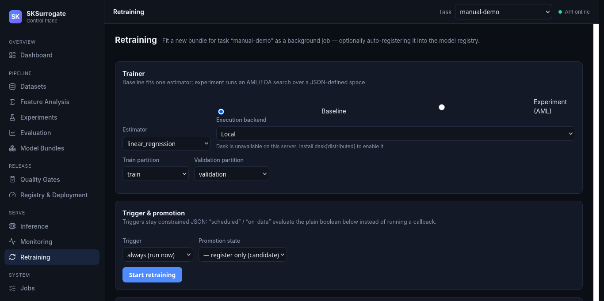

   Choose a one-off retraining run and its optional trigger/promotion settings.

12. Follow jobs and audit activity
----------------------------------

Use **Jobs** to filter background work by kind and status, inspect progress,
and review results or errors. Sensitivity analysis, experiments, nested CV,
and retraining can run in the background; their job records remain visible
after navigation. A failed experiment can expose a resume action when its
checkpoint is usable.

Use **Settings / Audit** to configure the API base URL and shared API key for
this browser, and to review task registry audit events. Connection settings
are browser-local; registry audit history is task data stored by the API.

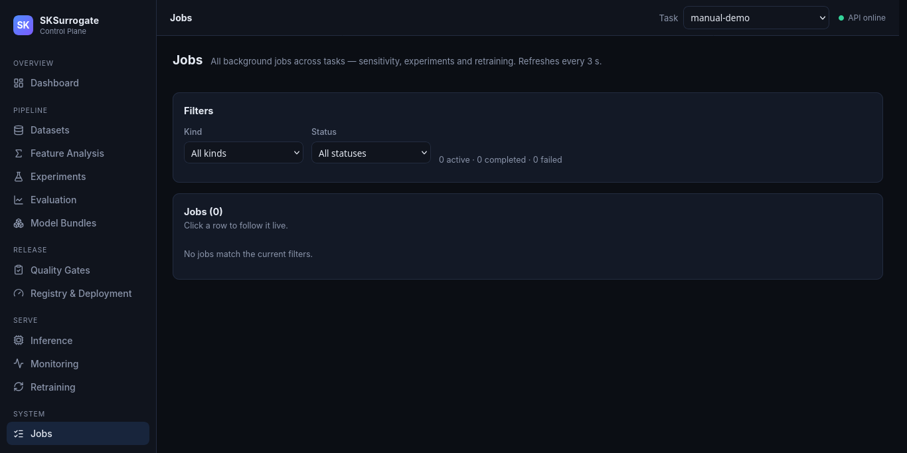

   Filter and inspect asynchronous work from across tasks.

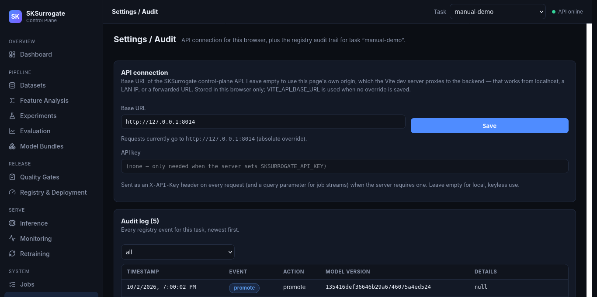

   Configure this browser's API connection and inspect registry audit events.

Feature-to-library reference
============================

The table summarizes where the UI workflow meets the package API. For
additional Python examples, see :doc:`code`, :doc:`mltrace`,
:doc:`modelbundles`, :doc:`inference`, and :doc:`monitoring`.

+----------------------+------------------------------------------------------+
| UI area              | Main SKSurrogate feature                             |
+======================+======================================================+
| Datasets             | ``mltrack.RegisterData``, schema validation, CV      |
+----------------------+------------------------------------------------------+
| Feature Analysis     | ``SensAprx``, ``CorrelationThreshold``, ``mltrack``  |
+----------------------+------------------------------------------------------+
| Experiments          | ``AML``, ``EOA``, ``SurrogateRandomCV``, stacking    |
+----------------------+------------------------------------------------------+
| Evaluation           | Nested CV, learning curves, sklearn scorers          |
+----------------------+------------------------------------------------------+
| Model Bundles        | ``ModelBundle``, ``save_bundle``, ``load_bundle``    |
+----------------------+------------------------------------------------------+
| Quality Gates        | ``check_bundle_quality``, ``assert_bundle_quality``  |
+----------------------+------------------------------------------------------+
| Registry & Deployment| ``ModelRegistry``, ``DeploymentApprovalGate``        |
+----------------------+------------------------------------------------------+
| Inference            | ``predict_batch``, ``SchemaValidationError``         |
+----------------------+------------------------------------------------------+
| Monitoring           | Drift, fairness, subgroup, delayed-label reports     |
+----------------------+------------------------------------------------------+
| Retraining           | ``RetrainingJob``, execution backends                |
+----------------------+------------------------------------------------------+

API users can browse the live request and response schemas at
``http://127.0.0.1:8013/docs`` while the service is running. To use SKSurrogate
without the web application, import the same library features directly from
Python as documented in :doc:`code`.
