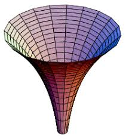

|Quality| |Doc|

|Logo|

SKSurrogate
==================
``SKSurrogate`` is a suite of tools which implements surrogate optimization for expensive
functions based on ``scikit-learn``. The main purpose of ``SKSurrogate`` is to facilitate
hyperparameter optimization for machine learning models and optimized pipeline design (AutoML).

The version of the surrogate optimization implemented here heavily relies on regressors.
A custom regressor based on Hilbert Space techniques is implemented, but all ``scikit-learn``
regressors are accepted for optimization.

Finding an optimized pipeline -based on a given list of transformers and estimators is
a time-consuming task. A version of evolutionary optimization has been implemented to reduce
its time in lieu of global optimality.

Dependencies
----------------
``SKSurrogate`` heavily depends on `NumPy <http://www.numpy.org/>`_,
`scipy <https://www.scipy.org/>`_, and `scikit-learn <https://scikit-learn.org/stable/>`_,
for its main functionalities. Other dependencies include `pandas <https://pandas.pydata.org/>`_,
`matplotlib <https://matplotlib.org/>`_, `SALib <https://github.com/SALib/SALib>`_,
`peewee <https://github.com/coleifer/peewee>`_, and
`tqdm <https://github.com/tqdm/tqdm>`_.

Documentation
----------------
The documentation is produced by `Sphinx <http://www.sphinx-doc.org/en/stable/>`_ and is intended to cover code usage
as well as a bit of theory to explain each method briefly.
For more details refer to the documentation at `sksurrogate.rtfd.io <http://sksurrogate.readthedocs.io/>`_.

License
================
This code is distributed under `MIT license <https://en.wikipedia.org/wiki/MIT_License>`_:

MIT License
----------------

    Copyright (c) 2019 Mehdi Ghasemi

    Permission is hereby granted, free of charge, to any person obtaining a copy
    of this software and associated documentation files (the "Software"), to deal
    in the Software without restriction, including without limitation the rights
    to use, copy, modify, merge, publish, distribute, sublicense, and/or sell
    copies of the Software, and to permit persons to whom the Software is
    furnished to do so, subject to the following conditions:

    The above copyright notice and this permission notice shall be included in all
    copies or substantial portions of the Software.

    THE SOFTWARE IS PROVIDED "AS IS", WITHOUT WARRANTY OF ANY KIND, EXPRESS OR
    IMPLIED, INCLUDING BUT NOT LIMITED TO THE WARRANTIES OF MERCHANTABILITY,
    FITNESS FOR A PARTICULAR PURPOSE AND NONINFRINGEMENT. IN NO EVENT SHALL THE
    AUTHORS OR COPYRIGHT HOLDERS BE LIABLE FOR ANY CLAIM, DAMAGES OR OTHER
    LIABILITY, WHETHER IN AN ACTION OF CONTRACT, TORT OR OTHERWISE, ARISING FROM,
    OUT OF OR IN CONNECTION WITH THE SOFTWARE OR THE USE OR OTHER DEALINGS IN THE
    SOFTWARE.

.. |Quality| image:: https://api.codacy.com/project/badge/Grade/9a4d3e663cb04128a06d47efc85f23da
    :target: https://www.codacy.com/app/mghasemi/sksurrogate?utm_source=github.com&amp;utm_medium=referral&amp;utm_content=mghasemi/sksurrogate&amp;utm_campaign=Badge_Grade
.. |Doc| image:: https://readthedocs.org/projects/sksurrogate/badge/?version=latest
    :target: https://sksurrogate.readthedocs.io/en/latest/?badge=latest
    :alt: Documentation Status
